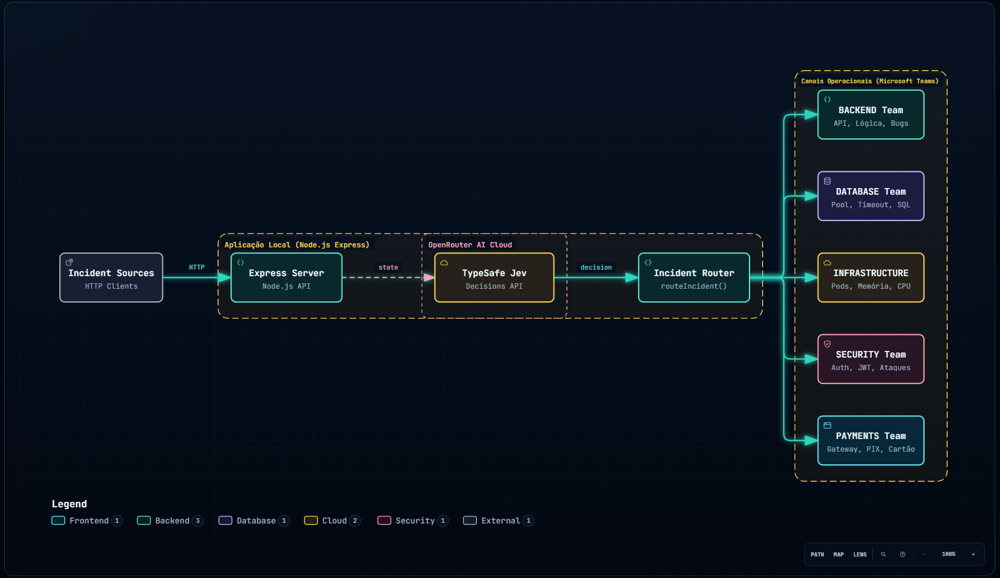
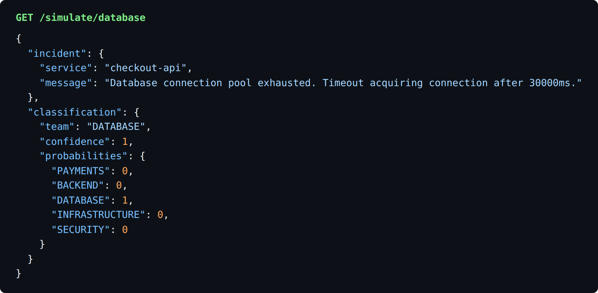
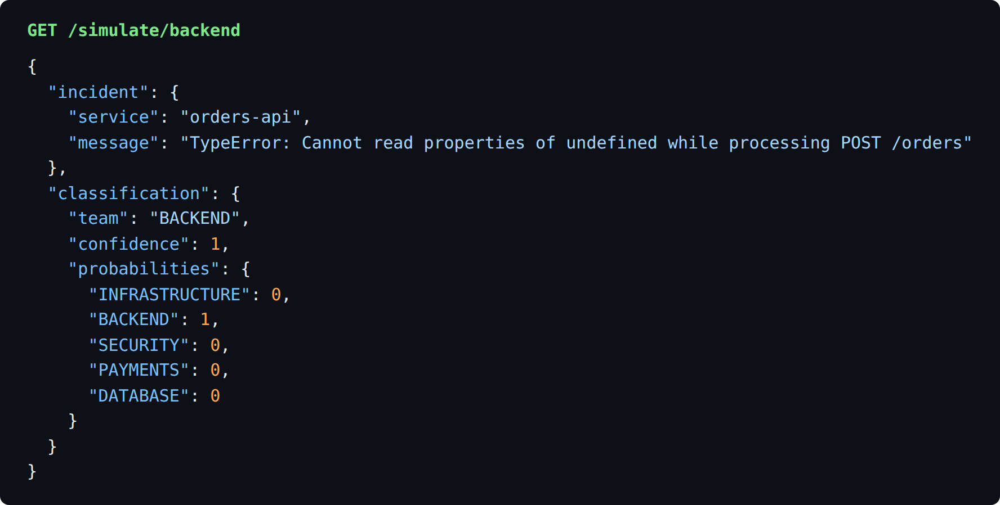
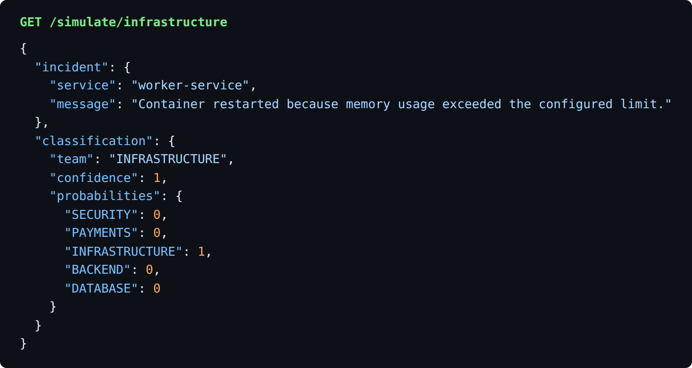
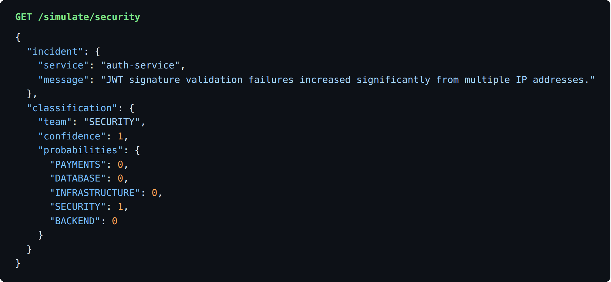
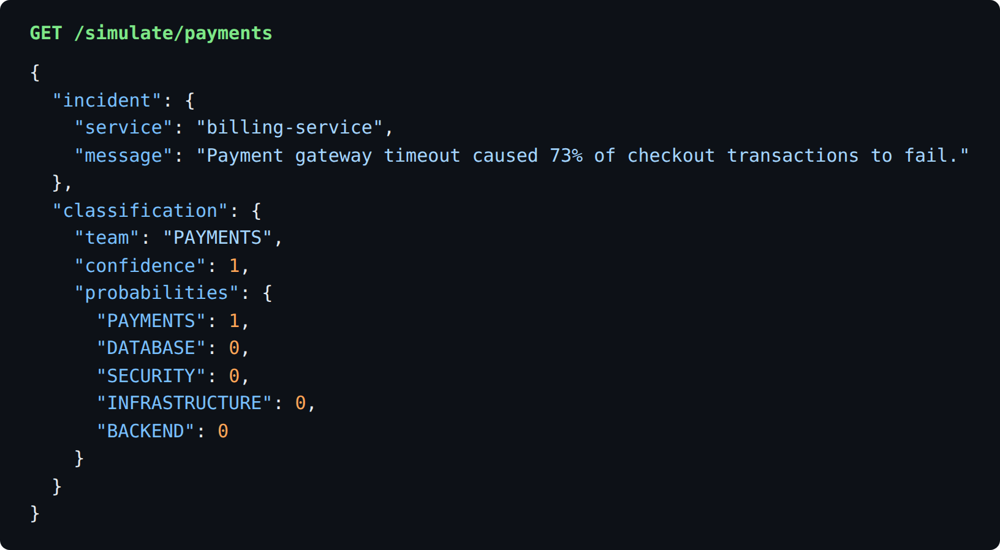
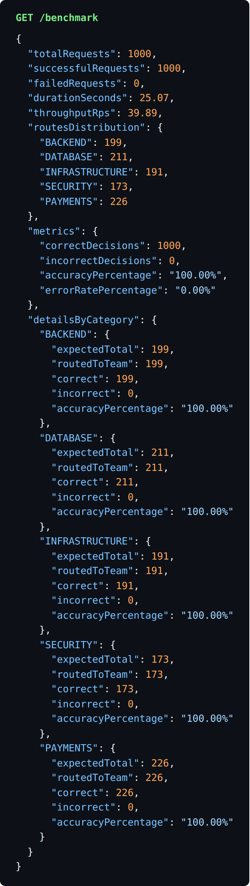

# Jev Incident Router ⚡

Demonstração prática do modelo **Jev** da TypeSafe AI (`~typesafe/jev-latest`) utilizando a **Decisions API** do OpenRouter para classificar e rotear incidentes de backend em tempo real.

O Jev é um modelo *"System One"*: em vez de gerar texto conversacional com risco de alucinação e alta latência, ele toma decisões probabilísticas, estruturadas e tipadas com extrema velocidade e baixo custo.

---

## 🧭 Fluxo de Decisão

Um incidente entra pelo servidor Express, o **Jev** (via OpenRouter) decide qual time deve recebê-lo e a função `routeIncident()` faz o encaminhamento para o canal operacional correto.



---

## 🚀 Como Executar

### 1. Instalar as dependências

```bash
npm install
```

### 2. Configurar as variáveis de ambiente

Copie o arquivo `.env.example` para `.env`:

```bash
cp .env.example .env
```

Abra o arquivo `.env` e configure sua chave do OpenRouter:

```env
OPENROUTER_API_KEY=sua_chave_aqui
PORT=3000
```

### 3. Iniciar o servidor

```bash
npm start
```

Ou em modo de desenvolvimento (com auto-reload do Node):

```bash
npm run dev
```

---

## 📡 Endpoints e Exemplos de Uso

### 1. Enviar Incidente Personalizado (`POST /incident`)

Envia um erro ou incidente customizado para classificação imediata:

```bash
curl -X POST http://localhost:3000/incident \
  -H "Content-Type: application/json" \
  -d '{
    "service": "checkout-api",
    "environment": "production",
    "statusCode": 500,
    "message": "Database connection pool exhausted",
    "details": "Timeout acquiring connection after 30000ms"
  }'
```

**Exemplo de Resposta:**

```json
{
  "incident": {
    "service": "checkout-api",
    "message": "Database connection pool exhausted"
  },
  "classification": {
    "team": "DATABASE",
    "confidence": 1,
    "probabilities": {
      "BACKEND": 0,
      "DATABASE": 1,
      "INFRASTRUCTURE": 0,
      "SECURITY": 0,
      "PAYMENTS": 0
    }
  }
}
```

---

### 2. Simular Incidentes Pré-definidos (`GET /simulate/:type`)

Simula incidentes reais de backend para teste rápido no navegador ou terminal:

- **Backend / Lógica da aplicação:**
  ```bash
  curl http://localhost:3000/simulate/backend
  ```

- **Banco de Dados / Conexões:**
  ```bash
  curl http://localhost:3000/simulate/database
  ```

- **Infraestrutura / Servidores / Pods:**
  ```bash
  curl http://localhost:3000/simulate/infrastructure
  ```

- **Segurança / Autenticação suspeita:**
  ```bash
  curl http://localhost:3000/simulate/security
  ```

- **Pagamentos / Gateways:**
  ```bash
  curl http://localhost:3000/simulate/payments
  ```

- **Aleatório (sorteia um dos cenários acima):**
  ```bash
  curl http://localhost:3000/simulate/random
  ```

**Exemplos de resposta reais:**

| Banco de dados | Backend |
| --- | --- |
|  |  |

| Infraestrutura | Segurança |
| --- | --- |
|  |  |

| Pagamentos |
| --- |
|  |

---

### 3. Benchmark de 1000 Requisições e Margem de Erro (`GET /benchmark`)

Executa um teste em lote de **1000 requisições** contra o Jev sorteando exemplos aleatórios. No final, exibe a distribuição exata entre os setores no `routeIncident`, a taxa de acurácia e a margem de erro.

- **Via HTTP (Navegador ou cURL):**
  ```bash
  curl http://localhost:3000/benchmark
  ```
  *Parâmetros opcionais:*
  `http://localhost:3000/benchmark?iterations=1000&concurrency=25`

- **Ou direto via CLI:**
  ```bash
  npm run benchmark
  ```

**Resultado de uma execução real:**



<details>
<summary>Ver o JSON completo</summary>

```json
{
  "totalRequests": 1000,
  "successfulRequests": 1000,
  "failedRequests": 0,
  "durationSeconds": 25.07,
  "throughputRps": 39.89,
  "routesDistribution": {
    "BACKEND": 199,
    "DATABASE": 211,
    "INFRASTRUCTURE": 191,
    "SECURITY": 173,
    "PAYMENTS": 226
  },
  "metrics": {
    "correctDecisions": 1000,
    "incorrectDecisions": 0,
    "accuracyPercentage": "100.00%",
    "errorRatePercentage": "0.00%"
  },
  "detailsByCategory": {
    "BACKEND": { "expectedTotal": 199, "routedToTeam": 199, "correct": 199, "incorrect": 0, "accuracyPercentage": "100.00%" },
    "DATABASE": { "expectedTotal": 211, "routedToTeam": 211, "correct": 211, "incorrect": 0, "accuracyPercentage": "100.00%" },
    "INFRASTRUCTURE": { "expectedTotal": 191, "routedToTeam": 191, "correct": 191, "incorrect": 0, "accuracyPercentage": "100.00%" },
    "SECURITY": { "expectedTotal": 173, "routedToTeam": 173, "correct": 173, "incorrect": 0, "accuracyPercentage": "100.00%" },
    "PAYMENTS": { "expectedTotal": 226, "routedToTeam": 226, "correct": 226, "incorrect": 0, "accuracyPercentage": "100.00%" }
  }
}
```

</details>

---

## 💸 Custo

As 1000 requisições do benchmark custaram **US$ 0,0492** no total, ou seja, cerca de **US$ 0,0000492 por decisão** (aproximadamente US$ 49 a cada milhão de incidentes classificados).

Para comparação, uma **estimativa** de como ficaria a mesma tarefa com um LLM generalista como o Claude Opus 5.5 (US$ 4 por milhão de tokens de entrada e US$ 20 por milhão de saída). Nenhuma chamada ao Opus foi feita; os números abaixo partem de suposições de tamanho de prompt e de resposta.

| Cenário estimado | Tokens por requisição (entrada / saída) | Custo de 1000 requisições | Comparado ao Jev |
| --- | --- | --- | --- |
| Jev (medido) | n/d | US$ 0,0492 | 1x |
| Opus, prompt enxuto | 300 / 40 | US$ 2,00 | ~41x |
| Opus, prompt com categorias e exemplos | 600 / 80 | US$ 4,00 | ~81x |
| Opus, modo em lote (50% de desconto) | 300 a 600 / 40 a 80 | US$ 1,00 a US$ 2,00 | ~20x a ~41x |

O valor do Jev foi medido; os do Opus são uma projeção e variam conforme o prompt real e a taxa de erro aceitável para o caso de uso.

---

## 📂 Estrutura do Projeto

```text
.
├── .env                         # Chave da API e configurações locais
├── .env.example                 # Modelo de variáveis de ambiente
├── .gitignore                   # Ignora node_modules e .env
├── package.json                 # Dependências mínimas (Express, dotenv)
├── README.md                    # Instruções de uso e documentação
├── flowchart.html               # 📊 Diagrama interativo de arquitetura gerado com Archify
├── flowchart.architecture.json  # Especificação da arquitetura Archify
├── docs/img/                    # Imagens usadas neste README
└── src/
    ├── benchmark.js             # Módulo de benchmark (1.000 requisições concorrentes)
    ├── cli-benchmark.js         # Script CLI para rodar o benchmark via terminal
    ├── incidents.js             # Catálogo de incidentes pré-definidos para simulação
    ├── index.js                 # Servidor Express, rotas e logs formatados
    ├── jev.js                   # Integração com a Decisions API do OpenRouter (~typesafe/jev-latest)
    └── router.js                # Função routeIncident() com os TODOs para Microsoft Teams
```

---

## 🎨 Visualização Interativa do Fluxo (Archify)

O arquivo [`flowchart.html`](./flowchart.html) foi gerado utilizando a ferramenta **[Archify](https://github.com/tt-a1i/archify)** com qualidade *showcase*. Ele contém:

- Pan & Zoom interativo
- Animação de fluxo de sinal (*trace animation*)
- Vistas selecionáveis (*Full flow*, *Decision engine*, *Dispatch teams*)
- Alternância entre tema Escuro / Claro
- Exportação para SVG, PNG e WebP
- Painéis de contexto arquitetural

